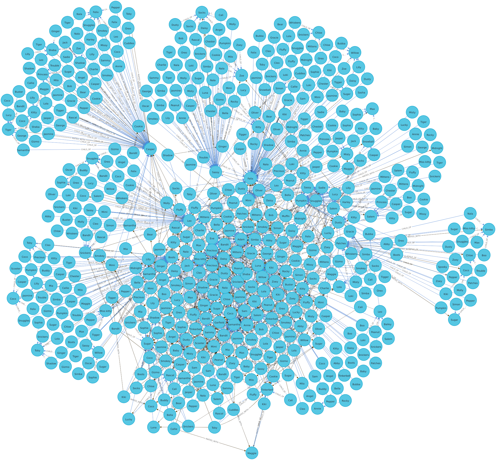
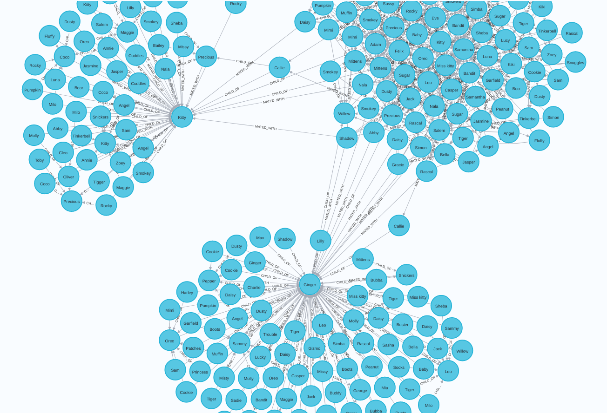

## Cat Simulation

Golang and Neo4j experiment

```bash
git clone git@github.com:taliptako/cat-simulation.git
cd cat-simulation 
cp .env-example .env # Fill your env
go run . # Run the simulation
```
    



